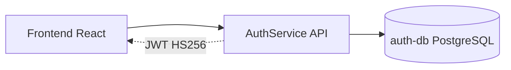

# AuthService

Servico C# em ASP.NET Core 8 responsavel exclusivamente por identidade: cadastro, login, emissao de JWT, perfil e administracao de usuarios. Ele nao conhece salas, locais ou reservas, mantendo a separacao de responsabilidades pedida no PDF.

O JWT e assinado com HS256 usando `JWT_SECRET`, compartilhado por variavel de ambiente com a Booking API. A senha e sempre armazenada com BCrypt cost 12.

## Arquitetura



## Endpoints

| Metodo | Rota | Auth | Descricao |
| --- | --- | --- | --- |
| POST | `/api/auth/register` | Nao | Cadastra usuario |
| POST | `/api/auth/login` | Nao | Retorna JWT |
| GET | `/api/auth/me` | Sim | Dados do usuario autenticado |
| PUT | `/api/auth/me` | Sim | Edita nome e foto do perfil |
| PUT | `/api/auth/me/password` | Sim | Altera senha propria |
| GET | `/api/auth/users` | Admin | Lista usuarios |
| PUT | `/api/auth/users/{id}` | Admin | Edita usuario, permissoes, foto e senha |
| DELETE | `/api/auth/users/{id}` | Admin | Exclui usuario |

## Variaveis

| Variavel | Obrigatoria | Descricao | Exemplo |
| --- | --- | --- | --- |
| `DATABASE_URL` | Sim | Conexao PostgreSQL | `Host=localhost;Port=5433;Database=auth_db;Username=auth_user;Password=auth_pass` |
| `JWT_SECRET` | Sim | Secret HS256, minimo 32 caracteres | `mude-para-uma-string-secreta-com-32-chars-minimo` |
| `JWT_EXPIRY_HOURS` | Nao | Expiracao do token | `8` |
| `ALLOWED_ORIGINS` | Sim | Origins permitidas no CORS | `http://localhost:5173,http://127.0.0.1:5173` |

## Como Rodar

```powershell
dotnet restore src/AuthService.API/AuthService.API.csproj
dotnet run --project src/AuthService.API/AuthService.API.csproj
```

Via Docker, na raiz do monorepo:

```powershell
docker compose up -d auth-db auth-service
```

## Testes

```powershell
dotnet test tests/AuthService.UnitTests/AuthService.UnitTests.csproj
```

Sem SDK local, rode com Docker:

```powershell
docker run --rm -v "${PWD}:/src" -w /src mcr.microsoft.com/dotnet/sdk:8.0 dotnet test tests/AuthService.UnitTests/AuthService.UnitTests.csproj
```

## Decisoes

- BCrypt cost 12: bom equilibrio entre seguranca e desempenho para senhas em repouso.
- JWT HS256: simples para o teste, validavel localmente pela Booking API sem chamada HTTP ao AuthService.
- `ProblemDetails`: erros consistentes e sem stack trace em producao.
- Rate limit no login: 5 tentativas por IP/minuto para reduzir brute force.
- Permissoes por role: `admin` acessa tudo; `user` fica restrito a dashboard, reservas e calendario.
