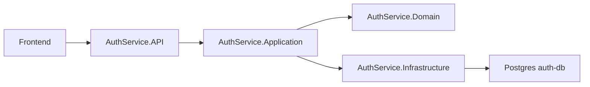

# Auth Service

Servico responsavel por cadastro, login, emissao de JWT e gerenciamento de usuarios. Ele nao conhece reservas, salas ou locais; sua responsabilidade e identidade e acesso.

O Auth Service foi implementado em ASP.NET Core 8 com Entity Framework Core e Postgres. Ele emite tokens JWT HS256 usando o `JWT_SECRET`, que deve ser o mesmo usado pela Booking API para validacao local.

## Arquitetura



## Pre-requisitos

| Ferramenta | Versao |
| --- | --- |
| .NET SDK | 8.0 |
| Docker | 24+ |
| Postgres | 16 |

## Variaveis de ambiente

| Variavel | Obrigatoria | Descricao | Exemplo |
| --- | --- | --- | --- |
| `DATABASE_URL` | Sim | Connection string do Postgres. | `Host=localhost;Port=5433;Database=auth_db;Username=auth_user;Password=auth_pass` |
| `JWT_SECRET` | Sim | Secret HS256 com minimo de 32 caracteres. | `mude-para-uma-string-secreta-com-32-chars-minimo` |
| `JWT_EXPIRY_HOURS` | Nao | Tempo de expiracao do token. | `8` |
| `ALLOWED_ORIGINS` | Sim | Origins liberadas no CORS. | `http://localhost:5173,http://127.0.0.1:5173` |

## Como rodar localmente

Via Docker Compose na raiz:

```bash
docker compose up --build auth-db auth-service
```

Via .NET SDK:

```bash
dotnet restore src/AuthService.API/AuthService.API.csproj
dotnet run --project src/AuthService.API/AuthService.API.csproj
```

O schema e criado no startup com EF Core. O usuario inicial de teste e `jefferson@teste.com` com senha `teste123` e papel `admin`.

## Endpoints

| Metodo | Rota | Auth | Body | Response |
| --- | --- | --- | --- | --- |
| POST | `/api/auth/register` | Nao | `{ name, email, password }` | `201 { id, name, email, createdAt }` |
| POST | `/api/auth/login` | Nao | `{ email, password }` | `200 { accessToken, expiresIn, user }` |
| GET | `/api/auth/me` | Sim | - | `200 { id, name, email, role, permissions, avatarUrl }` |
| PUT | `/api/auth/me` | Sim | `{ name, avatarUrl }` | `200 usuario atualizado` |
| PUT | `/api/auth/me/password` | Sim | `{ currentPassword, newPassword }` | `204` |
| GET | `/api/auth/users` | Admin | - | `200 usuarios` |
| PUT | `/api/auth/users/{id}` | Admin | dados, permissoes, foto e senha opcional | `200 usuario atualizado` |
| DELETE | `/api/auth/users/{id}` | Admin | - | `204` |

## Testes

```bash
dotnet test tests/AuthService.UnitTests/AuthService.UnitTests.csproj
```

Sem SDK local, use Docker:

```bash
docker run --rm -v "${PWD}:/src" -w /src mcr.microsoft.com/dotnet/sdk:8.0 dotnet test tests/AuthService.UnitTests/AuthService.UnitTests.csproj
```

## Decisoes tecnicas

| Decisao | Justificativa |
| --- | --- |
| ASP.NET Core 8 | Stack moderna e compativel com o requisito .NET 6+. |
| Clean Architecture | Separa dominio, casos de uso, infraestrutura e API. |
| BCrypt cost 12 | Aumenta resistencia contra brute force mantendo login viavel. |
| JWT HS256 | Simples para dois servicos internos com secret compartilhado via env. |
| Rate limit no login | Reduz tentativas automatizadas de senha. |
| ProblemDetails | Padroniza respostas de erro sem expor stack trace em producao. |

